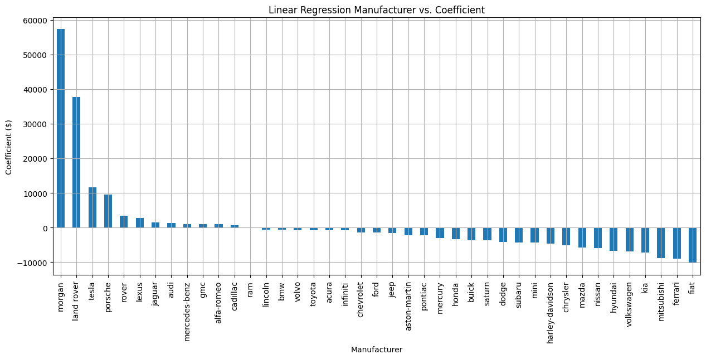
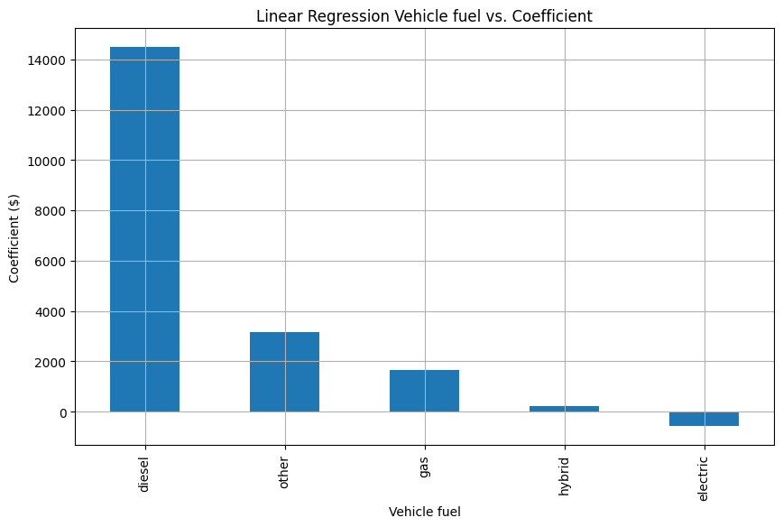
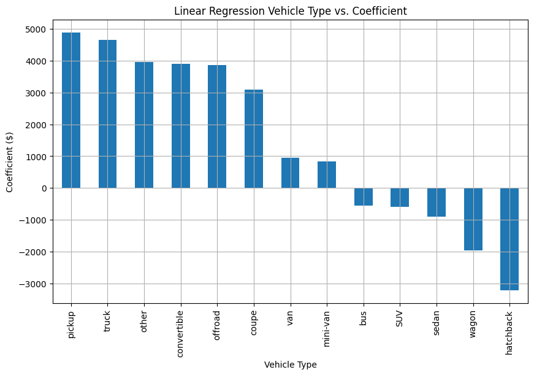

#### Summary
Based on a dataset that was provided of nearly half a million used car sales and their associated information, a set of analysis and modeling was done in order to assess what aspects of a car most significantly and directly drive sale price. Through this modeling, a set of 10 features of a car were used to successfully predict the sale price of a vehicle to within ~$5,000 on average. Through this model, any current or prospective car can be assessed based on its characteristics and the sale price can be predicted. Additionally, each feature's highest valued options can be studied directly for insight into what types of features drive prices.

This report contains details as to some of the most relevant findings that will help better understand what car features drive price, and how. Highlights of the key findings from this study include:
* Morgan, Land Rover, and Tesla generally drive the highest price impact of all manufacturers, with the brand alone driving as much as $58,000 of value alone (Morgan cars).
* Diesal vehicles commanded *significantly* more price than any other type of fuel (at least $10,000 more than any other type)
* Any Model Year + Odometer combination can be used to calculate the price impact of this specific combination

#### Details
For the modeling of the data, various data cleansing, feature selection, and regression models were implemented. The best performing model on a completely independent test set was selected and analyzed. This model was able to predict the sales price of any car in the cleaned dataset to within a mean absolute error of approximately $5,200. The model had an R2 of 0.673, meaning 67% of the variance in price was able to be explained via the 10 selected features.

Some of the most significant feature dependencies and influences on the price of the car are shown below. For each graph's categories, the coefficient indicates the dollar contribution to the price of the car.

##### Manufacturer Type

_Morgan and Land Rover, specifically drive very significant price value over other manufacturers._

##### Fuel Type

_Tend toward deseil, which commands a ~$10,000 premium over other fuel types._

##### Body Type

_Avoid hatchback and wagons, which go for $2,000 - $3,000 less than other body types._

#### Conclusion
In general, this analysis and model was largely a success as a first attempt to predict the price of a car. Now that an initial analysis and model has been created, additional data can be collected, potentially with more fidelity around the most important features as identified by this model. Depending on the desired accuracy of the model, additional refinement could be done, including approaches such as inflation compensation, advanced data restoration, and additional feature collection and modeling.